# Automação do Quiz DSC

Recebe o link do Quiz DSC por Telegram, preenche o Google Forms com um perfil fixo, resolve o quiz com o Gemini e envia a resposta toda terça-feira às 09h no horário de Brasília.

Tudo roda no GitHub Actions. Para usar, basta forkar este repositório e cadastrar os seus dados nas configurações do fork: você não precisa clonar nada nem instalar nada na sua máquina. Se quiser mexer no código, veja [Desenvolvimento local](#desenvolvimento-local).

## Como funciona

1. A automação `Coletar link do formulário DSC` consulta o bot a cada seis horas. O Telegram guarda updates pendentes por até 24 horas, então o polling periódico evita perder links enviados com antecedência.
2. Só são aceitas URLs do usuário configurado em `TELEGRAM_USER_ID`, no chat privado dele. Valem endereços `forms.gle` e páginas `https://docs.google.com/forms/.../viewform`.
3. O link validado vira um artefato privado por 14 dias. O update só é confirmado no Telegram depois disso.
4. Na terça-feira, a automação `Enviar o Quiz DSC semanal` baixa o link mais recente, preenche as seis páginas fixas, extrai o quiz, envia-o ao Gemini e pede uma resposta JSON estruturada.
5. Depois da confirmação, a automação abre **Ver pontuação**, registra a nota e a inclui na notificação do Telegram. Uma confirmação visível cria `dsc-success-AAAA-Www`. Se o clique acontecer sem confirmação, cria `dsc-unknown-AAAA-Www`. Os dois bloqueiam reenvios automáticos naquela semana.

## Antes de começar

Você vai precisar de uma conta no GitHub, uma Conta Google e o Telegram. O formulário precisa aceitar respostas sem login, e as perguntas do quiz precisam ser de escolha única.

São cinco valores para reunir:

| Variável | Obrigatória | Onde obter |
| --- | --- | --- |
| `GOOGLE_API_KEY` | Sim | [Chave de API do Gemini](#chave-de-api-do-gemini) |
| `GEMINI_MODEL` | Não. O padrão é `gemini-3.5-flash-lite` | [Lista de modelos do Gemini](https://ai.google.dev/gemini-api/docs/models?hl=pt-br) |
| `TELEGRAM_BOT_TOKEN` | Sim | [Bot e token do Telegram](#bot-e-token-do-telegram) |
| `TELEGRAM_USER_ID` | Sim | [Seu user ID do Telegram](#seu-user-id-do-telegram) |
| `DSC_PROFILE_JSON` | Sim | [Perfil do formulário](#perfil-do-formulário) |

### Chave de API do Gemini

1. Acesse [aistudio.google.com](https://aistudio.google.com) e entre com sua Conta Google. Na primeira visita, marque o contrato obrigatório e clique em **Continuar**.

   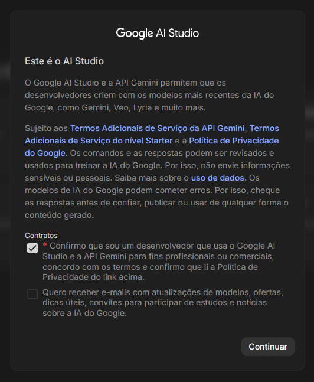

2. Na barra lateral, em **MANAGE**, abra **Dashboard**.

   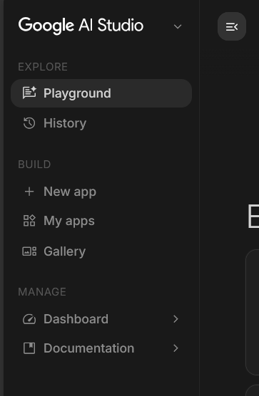

3. Vá em **Projetos** e clique em **Criar um novo projeto**. Se você já usa o Google Cloud, pode clicar em **Importar projetos**.

   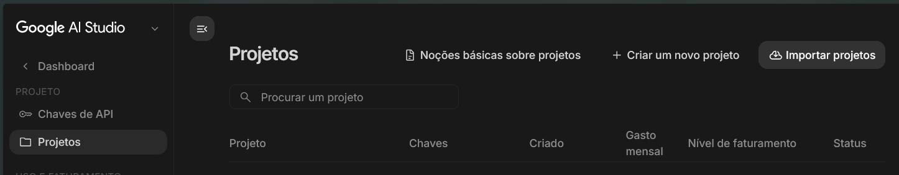

4. Com o projeto criado, confirme que o **Nível de faturamento** está como `Nível gratuito` e clique em **Criar chave de API** na linha do projeto.

   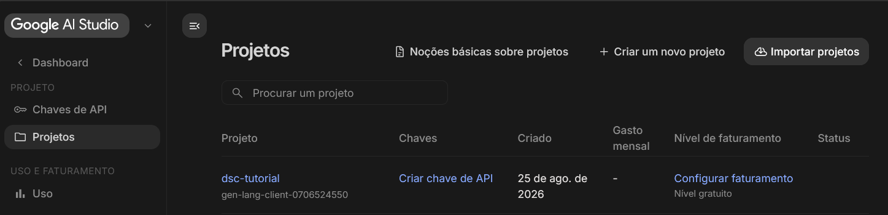

5. Dê um nome à chave, por exemplo `dsc`, selecione o projeto e clique em **Criar chave**.

   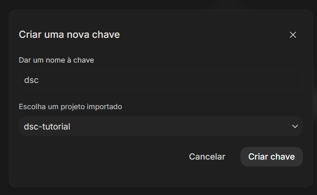

6. Clique em **Copiar chave**. Ela começa com `AQ.` e só aparece por completo aqui, então guarde-a antes de fechar o diálogo.

   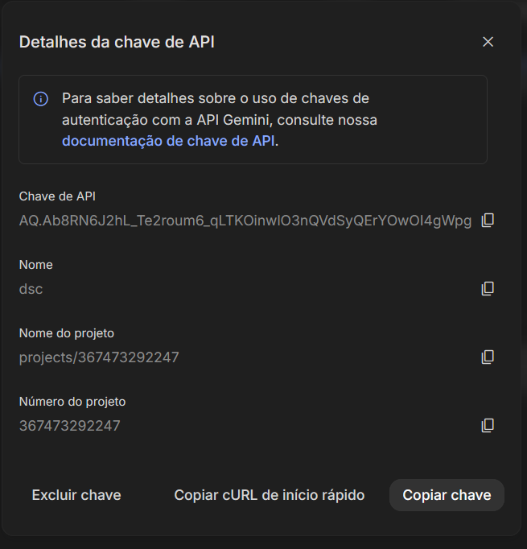

Esse valor é o seu `GOOGLE_API_KEY`.

### Bot e token do Telegram

1. Abra [@BotFather](https://t.me/BotFather) no Telegram e toque em **INICIAR**.

   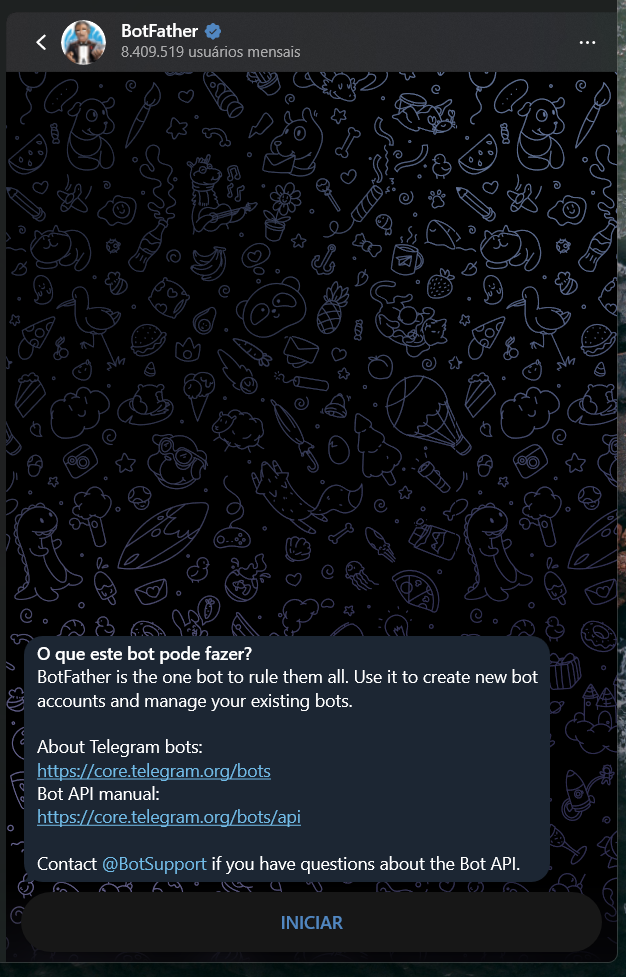

2. Envie `/newbot`, informe um nome de exibição, por exemplo `Automatizador do DSC`, e depois um username terminado em `bot`, por exemplo `auto_dsc_bot`. O BotFather responde com a linha **Use this token to access the HTTP API** seguida do token, no formato `123456789:AA...`.

   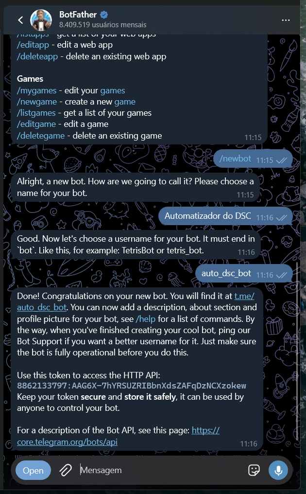

Esse token é o seu `TELEGRAM_BOT_TOKEN`. Quem tem o token controla o bot, então trate-o como senha e nunca o coloque em um arquivo versionado. Se ele vazar, use `/revoke` no BotFather para gerar outro.

Por fim, abra a conversa com o **seu** bot e toque em **INICIAR**. Sem essa primeira mensagem, o Telegram não deixa o bot enviar notificações para você.

### Seu user ID do Telegram

Abra [@idbot](https://t.me/idbot) e envie `/start`. A resposta traz o seu ID numérico, com cerca de 10 dígitos.

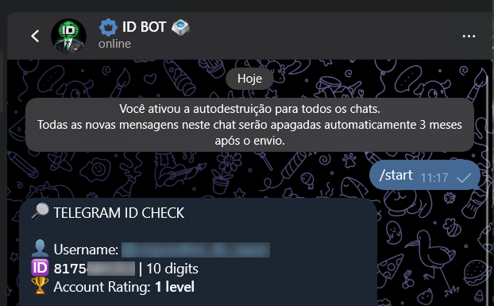

Copie apenas os dígitos para `TELEGRAM_USER_ID`, sem `@` e sem `#`.

O valor é conferido mais tarde, na [primeira validação](#6-primeira-validação-de-ponta-a-ponta): se o ID estiver errado, a coleta ignora as suas mensagens e o bot não responde nada.

### Perfil do formulário

`DSC_PROFILE_JSON` são os dados que se repetem toda semana no formulário. Ele precisa seguir este contrato, em uma única linha:

```json
{"fullName":"NOME","employeeId":"MATRICULA","city":"CIDADE","employmentType":"TIPO","supplier":"FORNECEDOR","region":"REGIONAL","manager":"GERENTE","workArea":"FRENTE"}
```

As oito chaves são obrigatórias e nenhuma pode ficar vazia. Os valores precisam corresponder exatamente ao texto que o Google Forms exibe, inclusive acentos.

## Colocando para rodar no GitHub

O caminho é forkar o repositório, cadastrar os valores, habilitar o Actions, rodar a Integração contínua para conferir se o fork está saudável e só então ligar as automações agendadas.

### 1. Criar o fork

Na página do repositório, clique em **Fork**.

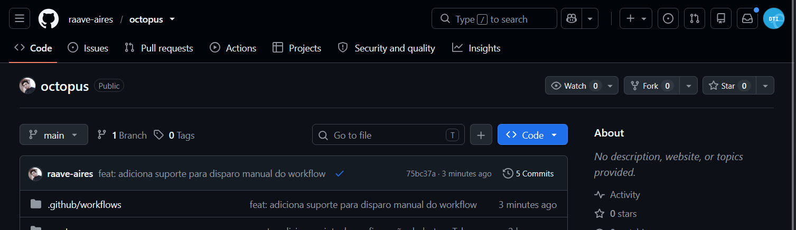

Escolha o dono do fork, mantenha **Copy the `main` branch only** marcado e clique em **Create fork**.

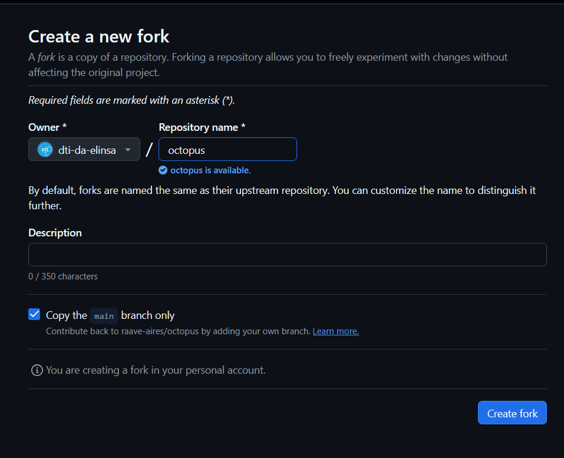

O agendamento só roda a partir da branch padrão, então copiar apenas a `main` basta.

### 2. Criar o environment e cadastrar os valores

As automações leem os valores de um **Environment** chamado `electric`. No seu fork, vá em **Settings → Environments**.

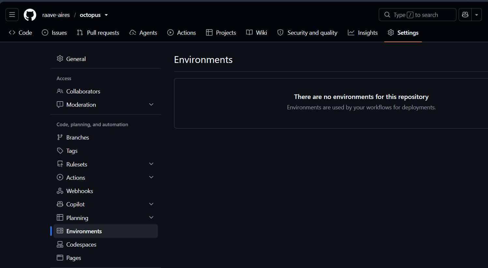

Clique em **New environment**, use exatamente o nome `electric` e confirme em **Configure environment**.

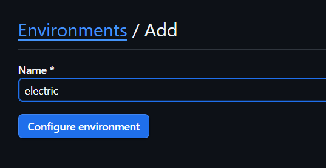

O nome precisa bater com o que está em `environment:` nos dois workflows. Se preferir outro nome, ajuste [collect-form-link.yml](.github/workflows/collect-form-link.yml) e [submit-weekly.yml](.github/workflows/submit-weekly.yml).

Dentro do environment existem duas listas separadas, **Environment secrets** e **Environment variables**.

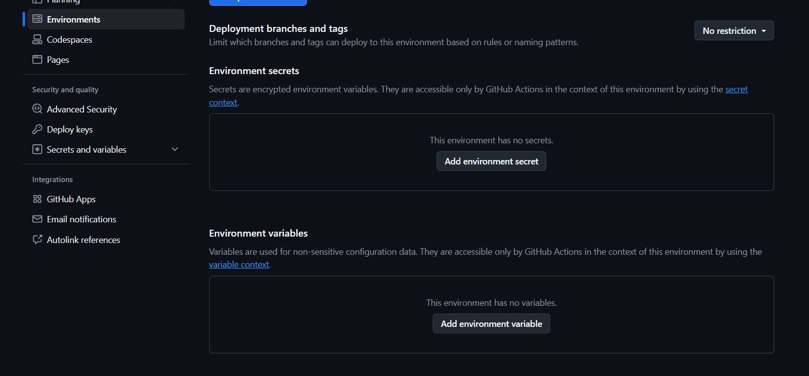

Em **Add environment secret**, cadastre os quatro segredos, um de cada vez, com o nome escrito exatamente como abaixo:

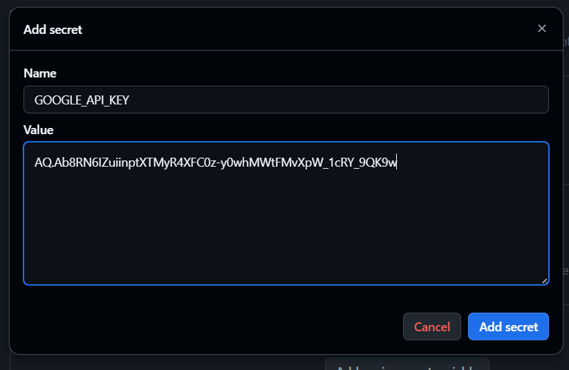

- `GOOGLE_API_KEY`
- `TELEGRAM_BOT_TOKEN`
- `TELEGRAM_USER_ID`, somente dígitos
- `DSC_PROFILE_JSON`, o JSON em uma única linha

Em **Add environment variable**, cadastre a única variável, `GEMINI_MODEL`. Ela é opcional: sem ela a automação usa `gemini-3.5-flash-lite`.

No final, a tela fica assim:

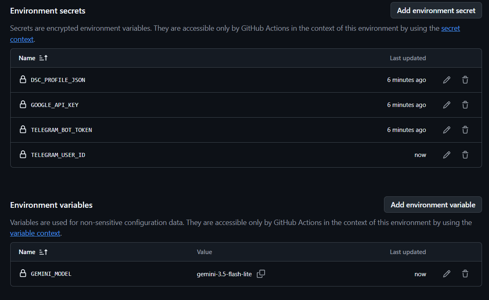

Secrets e variables são listas distintas. Um valor cadastrado na lista errada não é encontrado, e a automação falha com `Variável obrigatória ausente`.

### 3. Habilitar o Actions no fork

Forks vêm com os workflows desligados. Abra a aba **Actions** e clique em **I understand my workflows, go ahead and enable them**.

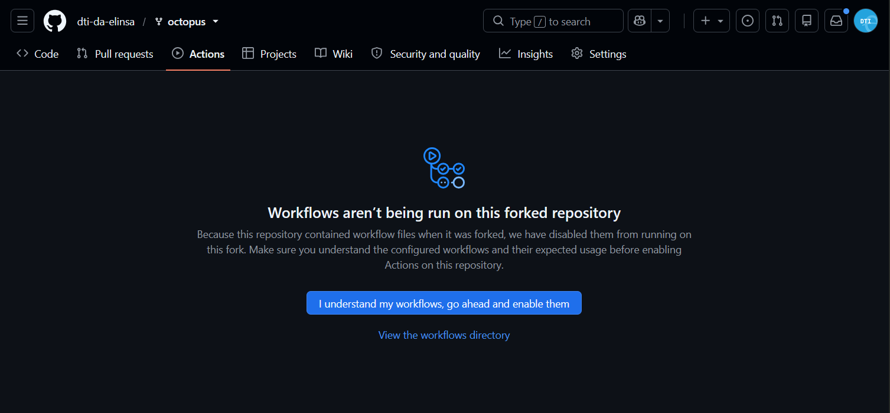

### 4. Rodar a Integração contínua

Antes de envolver o formulário de verdade, confira se o fork está saudável. Em **Actions**, selecione **Integração contínua** e clique em **Run workflow**.

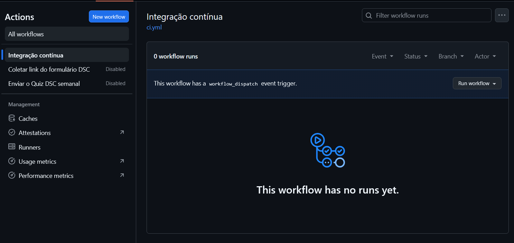

Essa automação roda a checagem de tipos, os testes unitários e os testes de navegador contra uma fixture local. Ela não usa nenhum dos seus segredos e não toca no Telegram, no Gemini nem no formulário real, então pode ser executada quantas vezes você quiser.

### 5. Habilitar as automações agendadas

Repare que `Coletar link do formulário DSC` e `Enviar o Quiz DSC semanal` continuam aparecendo como **Disabled**, porque o GitHub desliga workflows agendados em forks. Abra cada uma e clique em **Enable workflow**.

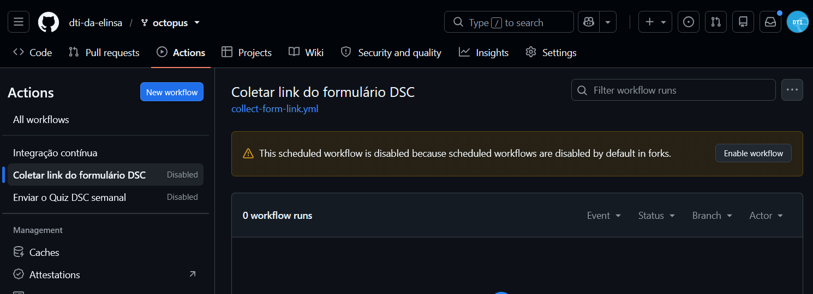

A partir daí os agendamentos valem: a coleta a cada seis horas e o envio nas terças.

### 6. Primeira validação de ponta a ponta

1. Envie o link atual do formulário ao seu bot.

2. Rode `Coletar link do formulário DSC` manualmente. O bot responde confirmando que guardou o link:

   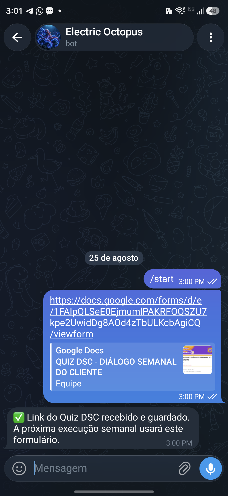

   Se não vier resposta nenhuma, o `TELEGRAM_USER_ID` provavelmente está errado, porque a coleta descarta mensagens de outros usuários.

3. Rode `Enviar o Quiz DSC semanal` com **Preencher e parar antes de Enviar** (dry-run) marcado. O bot avisa o tema, quantas perguntas o quiz tinha e a semana de referência:

   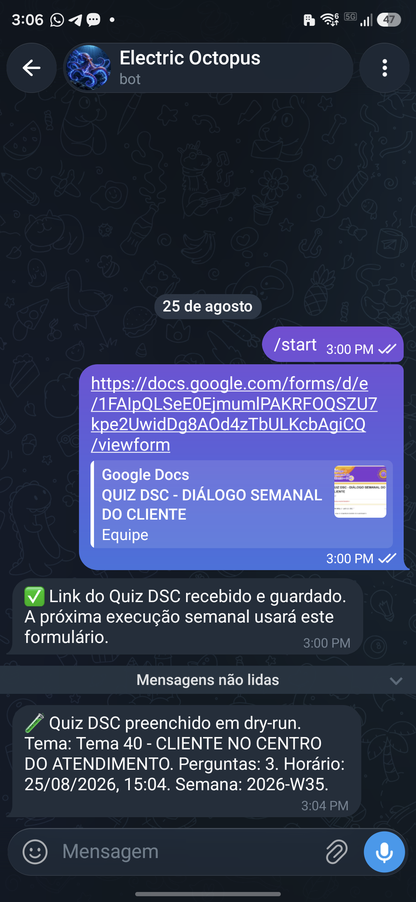

4. Feito o dry-run, o agendamento passará a enviar de verdade na data marcada. Para um envio real manual, desmarque **Preencher e parar antes de Enviar**.

## Desenvolvimento local

O projeto pede Node.js 24 e usa **pnpm**, com a versão fixada em `packageManager`, que o `corepack enable` resolve.

```powershell
Copy-Item .env.example .env
pnpm install
pnpm exec playwright install --only-shell chromium
```

Preencha o `.env` com as mesmas cinco variáveis. Ele é ignorado pelo Git e não deve ser commitado.

A automação roda com `headless: true` e sem `channel`, então o Playwright usa o Chrome Headless Shell. O `--only-shell` evita baixar o Chrome completo, que não é usado. Se algum dia o código passar a abrir o navegador com interface, troque por `pnpm exec playwright install chromium`.

Para conferir qual user ID o bot está enxergando, mande uma mensagem para ele e rode:

```powershell
pnpm run telegram:identify
```

O comando lista `userId`, `chatId`, update e data das mensagens privadas pendentes, e nunca imprime o token. Em conversa privada, `userId` e `chatId` são o mesmo número. Se a lista vier vazia, ou o bot ainda não recebeu mensagem sua, ou a automação de coleta já consumiu os updates pendentes: mande uma mensagem nova e repita.

Os testes:

```powershell
pnpm run typecheck
pnpm test
pnpm run test:e2e
```

Os testes de navegador usam uma fixture local com as seis páginas, os dropdowns ARIA customizados e o quiz B/C/C. A Integração contínua nunca chama o Telegram, o Gemini ou o formulário real.
